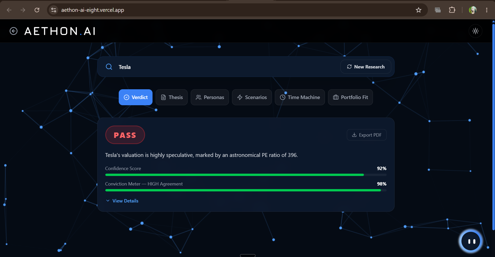
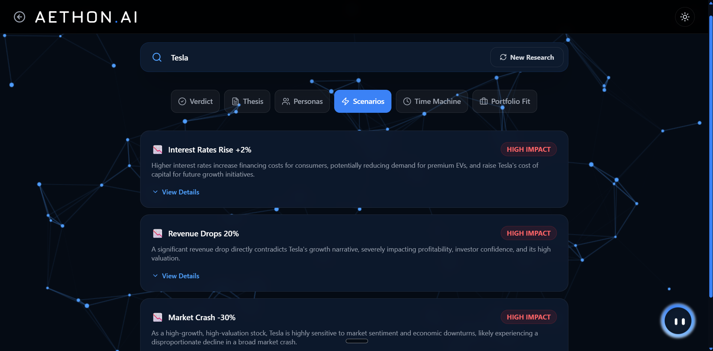
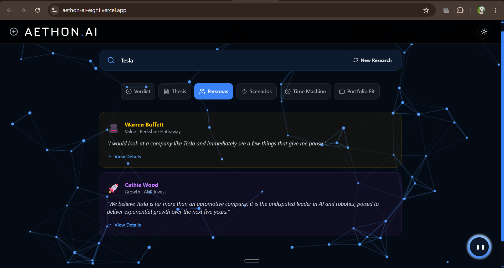

# Aethon AI - Investment Research Agent

**Live Deployment:** [Insert Vercel Link Here]

## Overview
Aethon AI is an explainable multi-agent investment research platform that analyzes a company using multiple AI analysts before producing an investment recommendation.

## Features
- **AI Investment Committee**
- **Judge Agent**
- **Explainable Decision Engine**
- **Company Research**
- **Bull vs Bear Debate**
- **Confidence Meter**
- **Scenario Simulator**
- **Interactive Chat**
- **Landing Page (Dark/Light Modes)**
- **PDF Export**

## Tech Stack
**Frontend:**
- React (Vite)
- Tailwind CSS
- GSAP / Framer Motion
- Recharts

**Backend:**
- Node.js
- Express

**AI:**
- LangChain.js
- LangGraph.js
- Gemini (2.5 Flash)

**APIs:**
- Finnhub
- NewsAPI

**Deployment:**
- Vercel (Frontend)
- Render (Backend)

## How to Run

1. **Clone the repository:**
   ```bash
   git clone https://github.com/Ashniya/Aethon.AI.git
   cd Aethon.AI
   ```

2. **Frontend:**
   ```bash
   cd frontend
   npm install
   npm run dev
   ```

3. **Backend:**
   ```bash
   cd backend
   npm install
   npm start
   ```

**Environment variables required in `backend/.env`:**
```env
GEMINI_API_KEY=your_key_here
FINNHUB_API_KEY=your_key_here
NEWS_API_KEY=your_key_here
PORT=5000
```
**Environment variables required in `frontend/.env`:**
```env
VITE_API_URL=http://localhost:5000
```

## Architecture

```text
React Frontend
      ↓
 Express API
      ↓
  LangGraph
      ↓
Investment Committee (Growth, Value, Skeptic, Risk)
      ↓
    Gemini
      ↓
   Response
      ↓
  Dashboard
```

## How It Works
1. User enters a company name on the landing page.
2. Backend fetches live financial data and news.
3. AI agents (Growth, Value, Risk, Skeptic) analyze different aspects concurrently.
4. Judge Agent combines the analyses and evaluates the debate.
5. Final recommendation and reasoning stream live to the dashboard.

## Key Decisions & Trade-offs
- *"I used Gemini 2.5 Flash as the primary LLM because of its generous free-tier limits and incredibly low latency, which is essential for a fast multi-agent system."*
- *"I chose LangGraph over standard chains because it naturally models non-linear, multi-agent committee workflows."*
- *"I skipped database integration and authentication to focus purely on advanced AI orchestration and building a production-grade, highly interactive user interface."*
- *"I utilized Server-Sent Events (SSE) to stream the AI's thought process live to the frontend, drastically improving UX over a static loading spinner."*

## Example Runs

Here is a look at the system in action:

**Landing Page & Features:**


**Company: Tesla (TSLA)**
**Result:** HOLD / INVEST (Debated)
*Below are snapshots of the multi-agent debate, final verdict, scenario simulators, and persona analyses applied to Tesla.*








## What I'd Improve (Future Goals)
- Real-time stock prices using TradingView or WebSockets
- Portfolio management & tracking
- User authentication
- Vector database memory (RAG) for reading SEC 10-K Filings
- Voice interaction
- Better news sentiment analysis 

---
### 🏆 Bonus: AI Chat Logs
The full chat session transcript and interaction logs documenting the prompt engineering, debugging, and architectural planning with the AI assistant are included in the root directory: **`AI_TRANSCRIPT.md`**. This provides insight into the development process and engineering judgment used to orchestrate this system.
